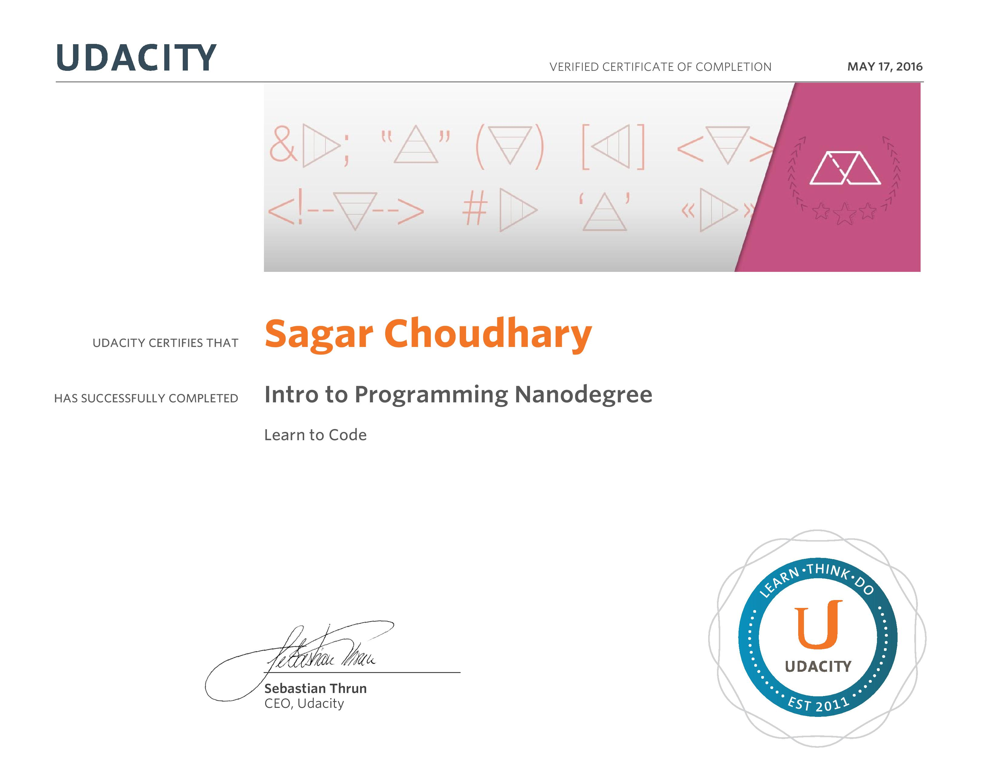

# Intro TO Programming NanoDegree Udacity

#### About NanoDegree
The NanoDegree Focuses on the foundational skills that all
programmers use whether they program mobile apps, create web pages, or analyze data.
Ideal for beginners who want to learn new skills, make informed choices about career goals

#### Topics Covered
* HTML
* CSS
* JavaScript
* Python Fundamentals
* Object Oriented Progamming Concepts
* BootsTrap
* Functions
* & Many More...

#### NanoDegree Certificate

